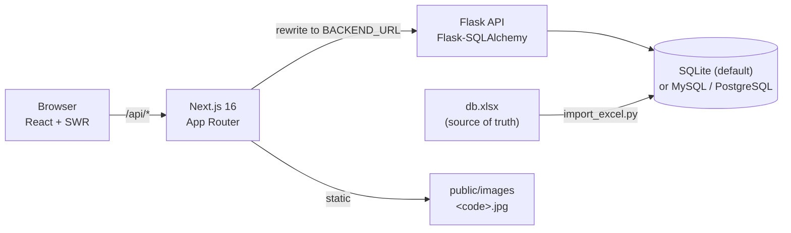

# Aquarius

> Browse 135 freshwater aquarium fish and check whether the species you pick can live together in your tank.

[](https://github.com/TheGreatArthur/aquariusproject/actions/workflows/ci.yml)
[](LICENSE)


**Live demo:** not deployed yet · **Portfolio page:** coming soon

## Features

- **Fish catalogue** — 135 species with water parameters (pH, GH, temperature), size, behaviour, lifespan and photos.
- **Fish profiles** — for each species, a French text on its description and naming, natural habitat and
  behaviour, with a range map (native countries, GBIF observations, rivers and lakes) and its IUCN status,
  written from FishBase, Seriously Fish and GBIF; the data itself was checked against the same sources
  ([report](docs/data-sources-check.md)).
- **Instant search** by common name, scientific name, family, genus or behaviour (accents ignored), plus a
  filter by family.
- **Modern, responsive UI** — dark theme with Tailwind CSS, subtle scroll animations,
  respecting *reduced motion*.
- **Family showcase** on the home page linking to each family's fish.
- **Tank simulator** — enter your tank volume, pH, GH and temperature and build a population checked by
  [14 compatibility rules](docs/compatibility-rules.md) (shared water, predation, temperament, current, group
  size, overpopulation…) with blocking / warning / info levels; each species shows its risks before you add it.
- **Contact form** sent through EmailJS.

| Fish list | Fish detail | Simulator |
|---|---|---|
|  |  |  |


## Architecture



The browser only talks to Next.js; Next.js proxies `/api/*` to Flask, which serves JSON from the database.
The data is maintained in an Excel workbook and loaded with `make import`. See the [ADRs](docs/adr/) for the reasoning.

| Endpoint | Description |
|---|---|
| `GET /poissons?q=<prefix>` | Quick search (common/scientific name, family, genus, behaviour) |
| `GET /poissons?famille=<name>` | Fish of one family |
| `GET /poissons/<id>` | One fish, including its images |
| `GET /poissons/familles` | All families, sorted |

## Tech stack

- **Front end:** Next.js 16, React 19, Tailwind CSS, Framer Motion, lucide-react, SWR,
  react-hook-form, EmailJS
- **Back end:** Python 3.11, Flask, SQLAlchemy 2, Alembic, openpyxl
- **Quality:** pytest + pytest-cov, ruff, ESLint, GitHub Actions

## Quick start

Prerequisites: **Python 3.11+**, **Node.js 20.9+**, `make`.

```bash
make dev
```

This installs the dependencies, creates `backend/config.py` and `frontend/.env.local` from their templates, and
starts the API on <http://localhost:5001> (not 5000, which macOS reserves for AirPlay) and the site on
<http://localhost:3000>.

To load the fish data, put the workbook at `backend/db.xlsx`, then:

```bash
make import
```

The import cleans and normalizes the workbook's labels, applies the reviewed corrections and loads the fish
profiles from `backend/data/`; run `make audit` to list values that look wrong
([docs/data-audit.md](docs/data-audit.md)) and `make sources` to compare the base with FishBase and
Seriously Fish (see [ADR 0006](docs/adr/0006-fish-profiles-and-sources.md) to add a species' profile).
Run `make help` for all commands. Configuration:

| Variable | Where | Default |
|---|---|---|
| `AQUARIUS_DSN` | backend | `sqlite:///backend/aquarius.db` |
| `AQUARIUS_EXCEL_FILE` | backend | `backend/db.xlsx` |
| `BACKEND_URL` | `frontend/.env.local` | `http://localhost:5001` |
| `NEXT_PUBLIC_EMAILJS_*` | `frontend/.env.local` | empty (contact form disabled) |

## Tests

```bash
make test   # backend (pytest) and front-end (Vitest) tests
make lint   # ruff + ESLint
make build  # production build of the front end
```

CI runs the same checks on every pull request and on pushes to `main`.

## Architecture decisions

- [0001 — Next.js front end + Flask API](docs/adr/0001-tech-stack.md)
- [0002 — SQL database fed from an Excel workbook, SQLite by default](docs/adr/0002-database-and-excel-import.md)
- [0003 — UI redesign: Tailwind CSS and Framer Motion](docs/adr/0003-ui-redesign-tailwind.md)
- [0004 — Data normalization, reviewed corrections and audit](docs/adr/0004-data-normalization-and-audit.md)
- [0005 — Compatibility rules engine with severities](docs/adr/0005-compatibility-rules-engine.md)
- [0006 — Fish profiles, reference sources and range maps](docs/adr/0006-fish-profiles-and-sources.md)
- [0007 — Upgrade to Next.js 16 and React 19](docs/adr/0007-nextjs-16-react-19.md)

## Roadmap & known limitations

- [ ] Deploy a public demo
- [ ] "Guide pratique" page (`/cours`) is a placeholder
- [ ] Import the `Plantes` sheet (plants) from the workbook
- [ ] End-to-end tests in a browser (the compatibility rules and search helpers have unit tests)
- The UI is in French only, dark theme only.
- Compatibility rules run in the browser and are indicative, not expert advice.

## Credits & license

Built by Arthur Litschig, with guidance from Laurent Daverio. Released under the [MIT License](LICENSE).
