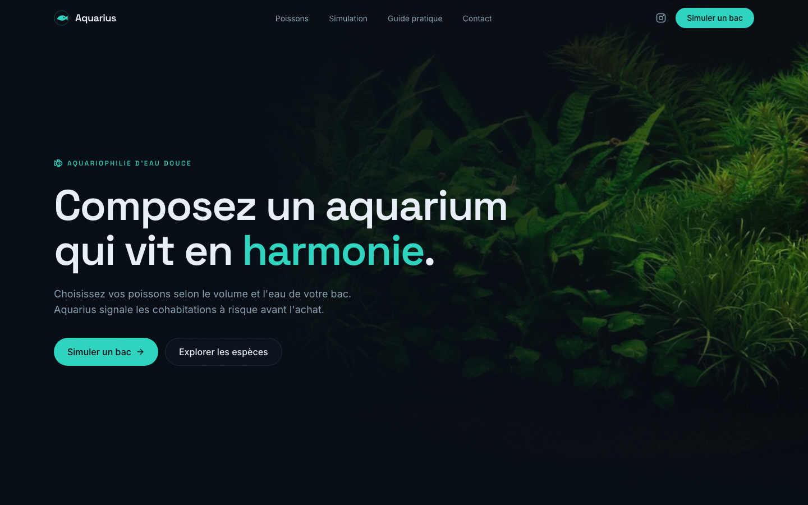
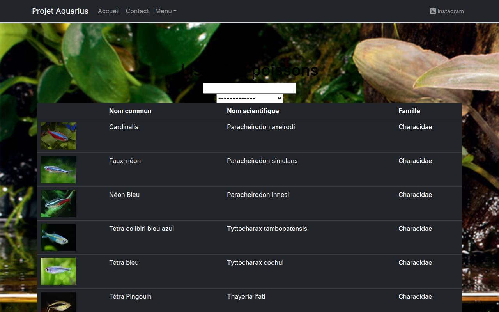
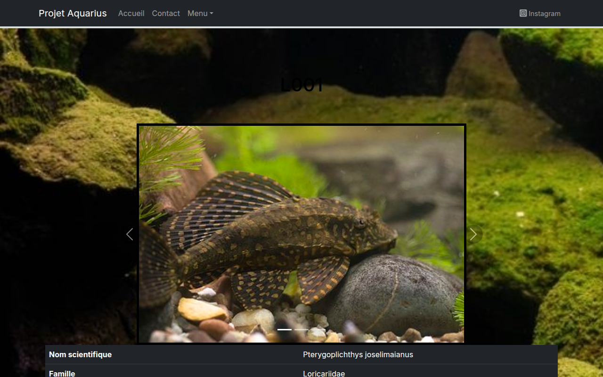
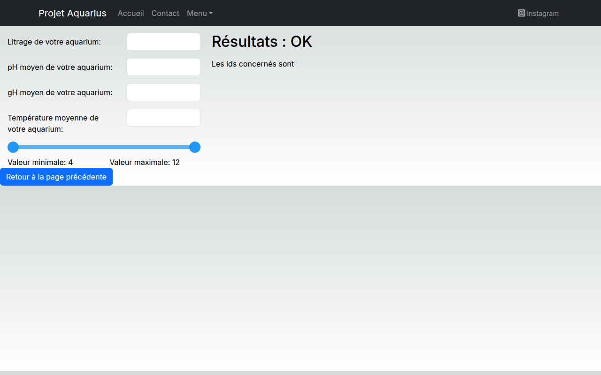
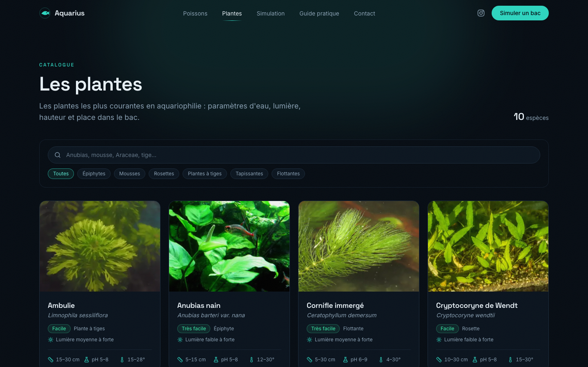
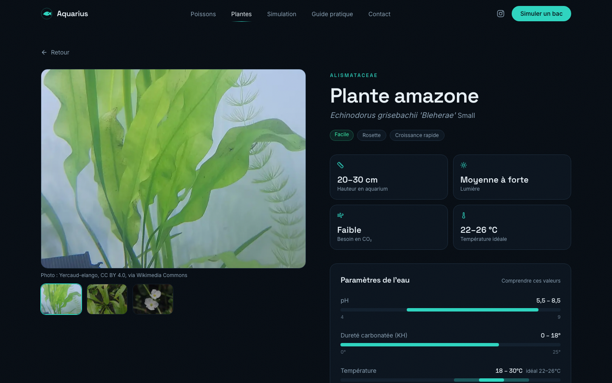
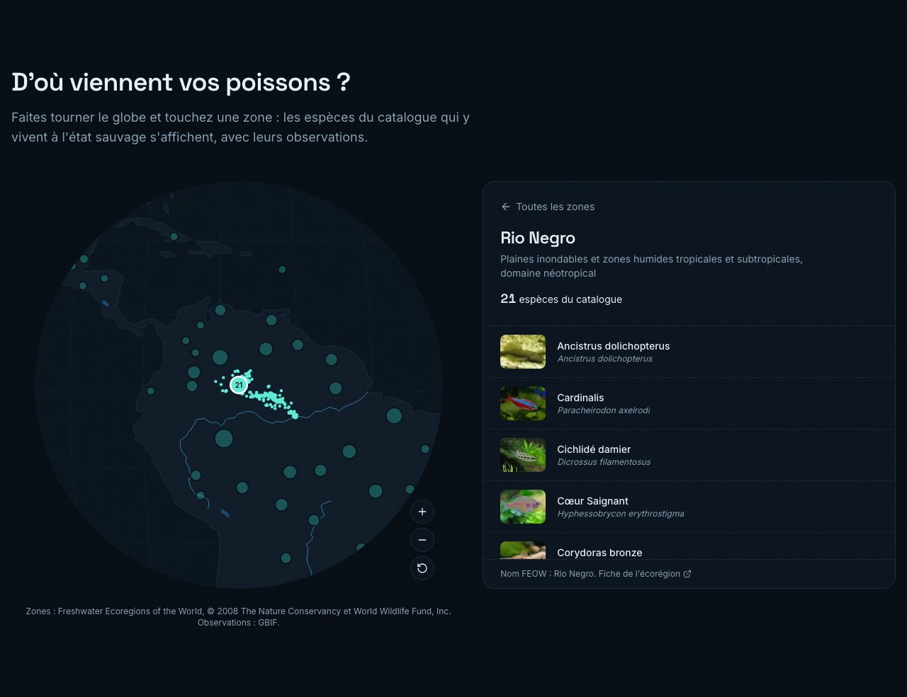
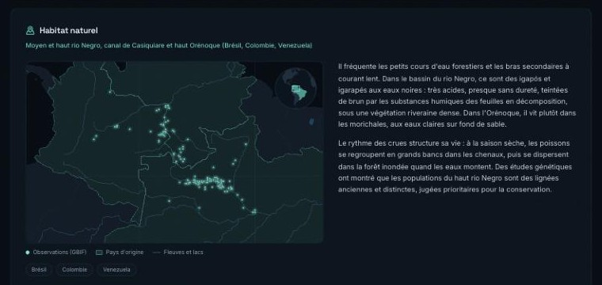
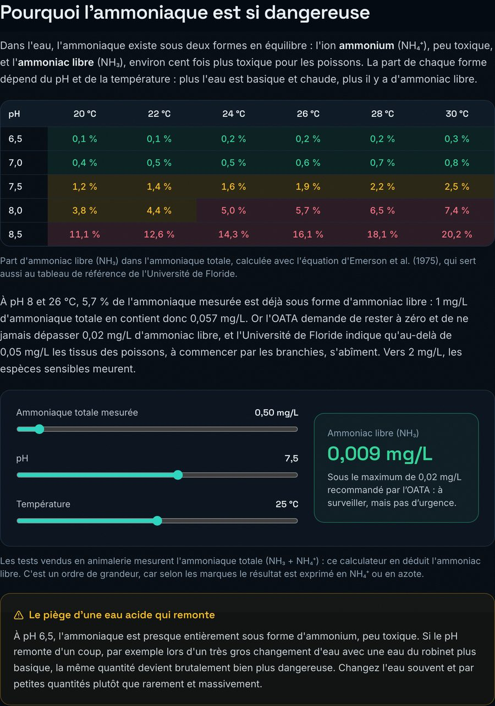
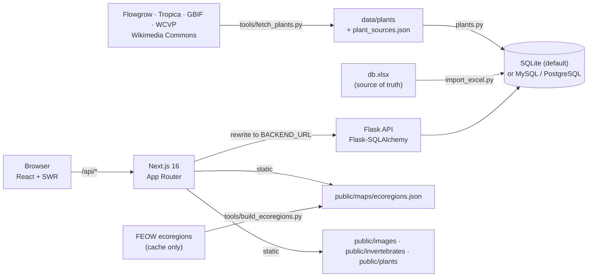

# Aquarius

> Browse 304 freshwater aquarium fish, 21 shrimps, crabs, snails and crayfish, and 132 aquarium plants, and check whether the species you pick can live
> together in your tank.

[](https://github.com/TheGreatArthur/aquariusproject/actions/workflows/ci.yml)
[](LICENSE)



**Live demo:** not deployed yet · **Portfolio page:** coming soon

## Features

- **Fish catalogue** — 304 species with water parameters (pH, GH, temperature), size, behaviour, lifespan and
  free-licensed photos credited to their authors.
- **Fish profiles** — for each species, a French text on its description and naming, natural habitat and
  behaviour, with a range map (native countries, GBIF observations, rivers and lakes) and its IUCN status,
  written from FishBase, Seriously Fish and GBIF; the data itself was checked against the same sources
  ([report](docs/data-sources-check.md)).
- **Invertebrate catalogue** — 21 shrimps, crabs, snails and crayfish with the same structure as the fish: water
  parameters, size, minimum tank, behaviour, range map, habitat, and maintenance, feeding and reproduction advice
  ([ADR 0012](docs/adr/0012-invertebrates-like-fish.md)).
- **Plant catalogue** — 132 species, forms and cultivars (Anubias, Java fern, Cryptocoryne, Rotala, Bacopa,
  Ludwigia, mosses, floating plants…) with pH, KH, tolerated and ideal temperature, light, growth, height,
  placement and propagation, French texts, and three free-licensed photos each with their credits. The data is
  scraped from Flowgrow, Tropica and GBIF, the photos from Wikimedia Commons and iNaturalist
  ([ADR 0009](docs/adr/0009-plants-scraped-data-and-free-photos.md)). The pages are built like the fish ones, with
  a range map of the native countries (World Checklist of Vascular Plants, Kew), the countries where the plant was
  introduced, and GBIF observations ([ADR 0013](docs/adr/0013-plants-like-fish-native-range.md)).
- **World globe** on the home page — turn it in any direction, pick one of the 121 freshwater ecoregions where the
  catalogue fish live (Rio Negro, Lake Malawi, Mekong Delta…) and see its species and their observations
  ([ADR 0010](docs/adr/0010-home-globe-freshwater-ecoregions.md)).
- **Instant search** by common name, scientific name, family, genus or behaviour (accents ignored), plus a
  filter by family.
- **Modern, responsive UI** — dark theme with Tailwind CSS, subtle scroll animations,
  respecting *reduced motion*.
- **Family showcase** on the home page linking to each family's fish.
- **Tank simulator** — enter your tank volume and water (or pick a typical water), then add fish, plants and
  invertebrates from one searchable list; the tank is checked by [23 compatibility rules](docs/compatibility-rules.md)
  (shared water, predation, shrimps eaten by fish, crayfish and assassin snails, plant light and plant eaters,
  temperament, current, group size, overpopulation…) with blocking / warning / info levels, and each species shows
  its risks before you add it ([ADR 0014](docs/adr/0014-simulator-fish-plants-invertebrates.md)).
- **Practical guide** — six French courses (nitrogen cycle, water parameters, equipment, plants and decor,
  maintenance, introducing and feeding fish) with diagrams computed from published formulas, two calculators
  (free ammonia, equipment for a given volume) and the sources of every figure.
- **Contact form** sent through EmailJS.

| Fish list | Fish detail | Simulator |
|---|---|---|
|  |  |  |

| Plant list | Plant detail |
|---|---|
|  |  |







## Architecture



The browser only talks to Next.js; Next.js proxies `/api/*` to Flask, which serves JSON from the database.
The data is maintained in an Excel workbook and loaded with `make import`. See the [ADRs](docs/adr/) for the reasoning.

| Endpoint | Description |
|---|---|
| `GET /poissons?q=<prefix>` | Quick search (common/scientific name, family, genus, behaviour) |
| `GET /poissons?famille=<name>` | Fish of one family |
| `GET /poissons/<id>` | One fish, including its images |
| `GET /poissons/familles` | All families, sorted |
| `GET /invertebres` | All invertebrates with their main photo, sorted by common name |
| `GET /invertebres/<id>` | One invertebrate, with its profile, photo credits and sources |
| `GET /plantes` | All plants with their main photo, sorted by common name |
| `GET /plantes/<id>` | One plant, with its texts, photo credits, sources, native and introduced countries and map points |

## Tech stack

- **Front end:** Next.js 16, React 19, Tailwind CSS, Framer Motion, lucide-react, SWR,
  react-hook-form, EmailJS
- **Back end:** Python 3.11, Flask, SQLAlchemy 2, Alembic, openpyxl; BeautifulSoup and Pillow for the data tools
- **Quality:** pytest + pytest-cov, ruff, ESLint, GitHub Actions

## Quick start

Prerequisites: **Python 3.11+**, **Node.js 20.9+**, `make`.

```bash
make dev
```

This installs the dependencies, creates `backend/config.py` and `frontend/.env.local` from their templates, and
starts the API on <http://localhost:5001> (not 5000, which macOS reserves for AirPlay) and the site on
<http://localhost:3000>.

To load the fish data, put the workbook at `backend/db.xlsx`, then:

```bash
make import
```

The import cleans and normalizes the workbook's labels, applies the reviewed corrections and loads the fish
profiles from `backend/data/`; run `make audit` to list values that look wrong
([docs/data-audit.md](docs/data-audit.md)) and `make sources` to compare the base with FishBase and
Seriously Fish (see [ADR 0006](docs/adr/0006-fish-profiles-and-sources.md) to add a species' profile).
The import then loads the species described by files in `backend/data/fish/` (`make fish` reloads them alone;
see [ADR 0011](docs/adr/0011-fish-added-as-data-files.md) to add a species and its photos), and the invertebrates of
`backend/data/invertebrates/` (`make invertebrates`, [ADR 0012](docs/adr/0012-invertebrates-like-fish.md)).
`make ecoregions` places the fish in their freshwater ecoregions for the home page globe
([ADR 0010](docs/adr/0010-home-globe-freshwater-ecoregions.md)). The import also loads the plants of `backend/data/plants/` (`make plants` reloads them alone); `make plants-fetch`
scrapes their data, native range and photos again (see [ADR 0009](docs/adr/0009-plants-scraped-data-and-free-photos.md)
to add a plant, [ADR 0013](docs/adr/0013-plants-like-fish-native-range.md) for the range), and `make occurrences`
refreshes the map points of fish, invertebrates and plants.
Run `make help` for all commands. Configuration:

| Variable | Where | Default |
|---|---|---|
| `AQUARIUS_DSN` | backend | `sqlite:///backend/aquarius.db` |
| `AQUARIUS_EXCEL_FILE` | backend | `backend/db.xlsx` |
| `BACKEND_URL` | `frontend/.env.local` | `http://localhost:5001` |
| `NEXT_PUBLIC_EMAILJS_*` | `frontend/.env.local` | empty (contact form disabled) |

## Tests

```bash
make test   # backend (pytest) and front-end (Vitest) tests
make lint   # ruff + ESLint
make build  # production build of the front end
```

CI runs the same checks on every pull request and on pushes to `main`.

## Architecture decisions

- [0001 — Next.js front end + Flask API](docs/adr/0001-tech-stack.md)
- [0002 — SQL database fed from an Excel workbook, SQLite by default](docs/adr/0002-database-and-excel-import.md)
- [0003 — UI redesign: Tailwind CSS and Framer Motion](docs/adr/0003-ui-redesign-tailwind.md)
- [0004 — Data normalization, reviewed corrections and audit](docs/adr/0004-data-normalization-and-audit.md)
- [0005 — Compatibility rules engine with severities](docs/adr/0005-compatibility-rules-engine.md)
- [0006 — Fish profiles, reference sources and range maps](docs/adr/0006-fish-profiles-and-sources.md)
- [0007 — Upgrade to Next.js 16 and React 19](docs/adr/0007-nextjs-16-react-19.md)
- [0008 — Practical guide written as data, with computed diagrams](docs/adr/0008-practical-guide-content.md)
- [0009 — Aquarium plants: scraped growing data and free-licensed photos](docs/adr/0009-plants-scraped-data-and-free-photos.md)
- [0010 — Home page globe of freshwater ecoregions](docs/adr/0010-home-globe-freshwater-ecoregions.md)
- [0011 — More fish: species added as data files, with the workbook's house rules](docs/adr/0011-fish-added-as-data-files.md)
- [0012 — Invertebrates stored and served like fish](docs/adr/0012-invertebrates-like-fish.md)
- [0013 — Plant pages built like fish pages, with a native range map](docs/adr/0013-plants-like-fish-native-range.md)
- [0014 — One simulator for fish, plants and invertebrates](docs/adr/0014-simulator-fish-plants-invertebrates.md)

## Roadmap & known limitations

- [ ] Deploy a public demo
- [ ] End-to-end tests in a browser (the compatibility rules and search helpers have unit tests)
- The UI is in French only, dark theme only.
- Compatibility rules run in the browser and are indicative, not expert advice.

## Credits & license

Built by Arthur Litschig, with guidance from Laurent Daverio. Released under the [MIT License](LICENSE).

The globe zones (`frontend/public/maps/ecoregions.json`) are derived from Freshwater Ecoregions of the World,
© 2008 The Nature Conservancy and World Wildlife Fund, Inc. ([www.feow.org](https://www.feow.org); Abell et al. 2008,
BioScience 58(5): 403-414), used for non-commercial, educational purposes under its own terms, not under the MIT
licence. Base maps: Natural Earth (public domain).

Plant photos come from Wikimedia Commons and iNaturalist and keep their own licences (CC0, public domain, CC BY,
CC BY-SA): each author and licence is shown on the plant's page and listed in `backend/data/plant_sources.json`.
